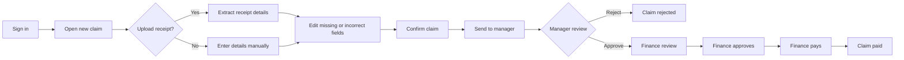
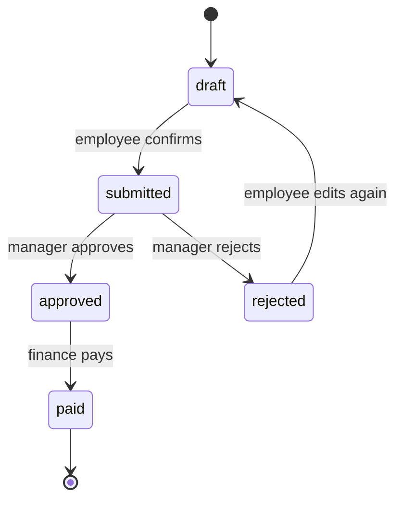

# Expense Claims

Expense Claims is a small web application for recording, reviewing, approving, and paying employee expenses.

It uses FastAPI, Jinja2, MongoDB, and server-rendered HTML. There is no frontend build step.

## What The App Does

- Employees enter a claim manually or upload a receipt.
- Receipt details are extracted when PDF or OCR support is available.
- Extracted values are placed into an editable form.
- The employee confirms the details before sending the claim.
- A manager approves or rejects team claims.
- Finance reviews manager-submitted claims, approves them, and pays approved claims.
- Duplicate receipts are detected before submission.
- Finance can view monthly reports and export CSV data.

## User Flow



## Claim States



Paid claims are final. A manager cannot approve their own claim. Finance can approve submitted claims filed by managers, then pay approved claims.

## Roles

| Role    | Main actions                                                               |
| ------- | -------------------------------------------------------------------------- |
| Staff   | Create claims, review details, and track personal claims                   |
| Manager | Create personal claims and approve or reject assigned team claims          |
| Finance | Review manager claims, approve them, pay approved claims, and view reports |
| Admin   | Enroll, edit, deactivate, and inspect employee accounts                    |

## Project Layout

```text
app/
  main.py                 FastAPI application and middleware
  models.py               Validated users, claims, roles, and statuses
  db.py                   MongoDB client and indexes
  routes/web.py           Web pages and form actions
  services/
    claims.py             Claim state transitions and permissions
    duplicates.py         Duplicate receipt detection
    parsing.py            Gemini and local receipt parsing
    receipt_files.py      PDF text and image OCR extraction
    reports.py            Monthly finance reports
  templates/              Jinja2 HTML pages
  static/                 Shared CSS
scripts/
  init_db.py              Create collections and indexes
  seed.py                 Add demo users and sample claims
 tests/                   Unit tests using mongomock
```

## Run Locally

Requirements: Python 3.11 or newer and MongoDB 6+ or MongoDB Atlas.

Windows PowerShell:

```powershell
python -m venv .venv
.\.venv\Scripts\Activate.ps1
pip install -r requirements.txt
Copy-Item .env.example .env
python scripts/init_db.py
python scripts/seed.py
python -m uvicorn app.main:app --reload
```

Open <http://127.0.0.1:8000>.

macOS/Linux:

```bash
python3 -m venv .venv
source .venv/bin/activate
pip install -r requirements.txt
cp .env.example .env
python scripts/init_db.py
python scripts/seed.py
uvicorn app.main:app --reload
```

## Demo Accounts

Seeded employee accounts use `Welcome@123`. The admin account uses `Admin@12345`.

Change these passwords before sharing a deployment. A real production system should use managed authentication, MFA, password recovery, and audit logging.

## Configuration

Set these values in `.env`. Never commit `.env` or send secrets through chat.

| Variable       | Required | Purpose                                              |
| -------------- | -------- | ---------------------------------------------------- |
| `MONGODB_URI`  | Yes      | Local MongoDB URI or Atlas `mongodb+srv://` URI      |
| `MONGODB_DB`   | Yes      | Database name, such as `expense_claims`              |
| `SECRET_KEY`   | Yes      | Long random value used to sign sessions              |
| `APP_ENV`      | Yes      | Use `development` locally and `production` on Render |
| `LLM_PROVIDER` | No       | Set to `gemini` to enable Google AI Studio parsing   |
| `LLM_API_KEY`  | No       | Google AI Studio key; leave empty for local parsing  |

Create a session secret with:

```bash
python -c "import secrets; print(secrets.token_urlsafe(48))"
```

The application stores money as integer paise internally to avoid decimal rounding errors. The claim form displays rupees and converts them before saving.

## Receipt Extraction

- PDF text extraction works through the Python dependencies.
- Image extraction needs Tesseract installed and available on `PATH`.
- Gemini can improve structured extraction when configured.
- If extraction cannot find a value, the employee fills it manually.
- Extracted data is always shown for user confirmation before submission.

On a small free hosting plan, local Tesseract may not be installed. Manual entry remains available, and cloud extraction should be used only with proper API-key and cost controls.

## Deploy On Render

1. Create a MongoDB Atlas database.
2. Create a database user and allow Render to connect. A free Render service does not have a fixed outbound IP, so `0.0.0.0/0` may be needed for a demo deployment.
3. Create a Render Web Service from this repository.
4. Use the settings in `render.yaml`.
5. Add `MONGODB_URI`, `MONGODB_DB`, `SECRET_KEY`, and optional Gemini variables in Render.
6. Deploy and check `/healthz`.
7. Run `python scripts/init_db.py` and `python scripts/seed.py` once with the same environment variables.

The free Render service can sleep. The first request after inactivity may take several seconds. Use private networking, restricted database access, stronger authentication, and persistent receipt storage for production.

## Deploy On Vercel

1. Push this repository to GitHub, including `api/index.py` and `vercel.json`.
2. Import the repository at <https://vercel.com/new>.
3. Keep the detected Python settings and deploy without a build command.
4. Add `MONGODB_URI`, `MONGODB_DB`, `SECRET_KEY`, and `APP_ENV=production` under Project Settings > Environment Variables.
5. Redeploy and check `/healthz` on the Vercel URL.

Vercel runs this application as a serverless FastAPI function. MongoDB Atlas is still required, and uploaded files are temporary. Image OCR may not work because the Vercel runtime does not include the system Tesseract executable.

## Test And Check

Run the full test suite:

```powershell
.\.venv\Scripts\python.exe -m pytest -q
```

Run a syntax check:

```powershell
.\.venv\Scripts\python.exe -m compileall -q app
```

The tests use `mongomock`, so they do not need a live MongoDB server.

## Important Limits

This is a demonstration application. It does not yet include SSO, MFA, email notifications, persistent receipt storage, line-item accounting, category budgets, or complete browser-level integration tests. These should be added before using it for real company payments.

More technical details are available in [docs/PROJECT_GUIDE.md](docs/PROJECT_GUIDE.md) and [docs/DATABASE_SCHEMA.md](docs/DATABASE_SCHEMA.md).
