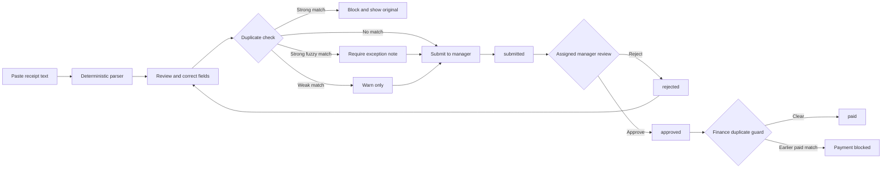
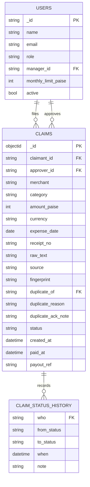

# Expense Claims Project Guide

## 1. Project summary

Expense Claims digitizes the path from a staff member's receipt to a manager-approved and finance-paid reimbursement. The application is intentionally small and server-rendered:

- FastAPI exposes HTTP routes and health checks.
- Jinja2 renders the pages; HTMX is available for progressive enhancement without a build step.
- Pydantic validates environment values and domain data.
- MongoDB stores users and claims.
- The claim service owns the state machine and audit history.
- The duplicate service checks every non-rejected claim across all users.
- The parser extracts receipt fields locally and can use Google AI Studio Gemini when `LLM_PROVIDER=gemini` and `LLM_API_KEY` are set. Provider failures fall back to the local parser.
- The report service uses Mongo aggregation for monthly finance views.
- Payouts are emulated and protected by an atomic approved-status update.

The application uses seeded demo authentication. A reviewer selects a seeded user rather than entering a password. Production authentication should replace this with SSO or a properly managed password and MFA system.

## 2. Roles and responsibilities

| Role    | Capabilities                                                                                                             |
| ------- | ------------------------------------------------------------------------------------------------------------------------ |
| Staff   | Parse receipt text, correct extracted fields, submit claims, and view own claims.                                        |
| Manager | View assigned claims, approve or reject team claims, and file personal claims. A manager cannot approve their own claim. |
| Finance | View approved claims, emulate payouts, inspect monthly spend, and export a CSV report.                                   |

## 3. Workflow



### State machine

```text
draft -> submitted -> approved -> paid
                  \-> rejected -> draft
```

`paid` is terminal. Every valid transition appends `who`, `from`, `to`, `when`, and an optional note to `status_history`.

## 4. ER diagram



`CLAIM_STATUS_HISTORY` is embedded as the `status_history[]` array inside each claim document rather than stored as a separate MongoDB collection. `manager_id` is a self-reference in `USERS`. The diagram shows the logical relationships, while MongoDB stores the two top-level collections: `users` and `claims`.

## 5. Duplicate rules

All checks query claims from every user and exclude `rejected` claims:

1. Strong: normalized merchant plus exact amount and date, or the same receipt number with a similar merchant. Block submission.
2. Strong fuzzy: exact amount, merchant token-set score at least 85, and dates within 30 days. Block unless the user supplies a mandatory exception note.
3. Weak: same claimant, same date, and amount within 2%. Warn without blocking.

Merchant normalization lowercases text, removes punctuation and filler words such as `pvt`, `ltd`, `restaurant`, `hotel`, `cafe`, `the`, and `and`.

## 6. Configuration checklist

1. Copy `.env.example` to `.env`.
2. Set `MONGODB_URI` and `MONGODB_DB`.
3. Generate and set a unique `SECRET_KEY`.
4. Leave `LLM_API_KEY` empty for the no-key deterministic parser, or set it privately with `LLM_PROVIDER=gemini` to enable Google AI Studio extraction.
5. Use `APP_ENV=production` on Render so session cookies are HTTPS-only.
6. Run the seed script once.
7. Verify `/healthz` and then sign in as each seeded role.

No key or password should be sent to the assistant or committed to the repository. The key is never logged.

## 7. Testcase catalog

The current suite contains 15 tests.

| ID     | Area          | Test                                                                 | Expected result                                               |
| ------ | ------------- | -------------------------------------------------------------------- | ------------------------------------------------------------- |
| WF-01  | Workflow      | Staff submits, manager approves, finance pays                        | All transitions succeed and history has three entries.        |
| WF-02  | Workflow      | Attempt transition out of paid                                       | Raises `paid claims are final`.                               |
| WF-03  | Authorization | Manager claims their own expense                                     | Approval is rejected.                                         |
| WF-04  | Authorization | Wrong manager approves                                               | Approval is rejected.                                         |
| WF-05  | Concurrency   | Pay an already-paid claim again                                      | Second payment is rejected by status guard.                   |
| DUP-01 | Duplicate     | Normalize merchant and build fingerprint                             | `MERU CABS PVT LTD` matches `meru cabs`.                      |
| DUP-02 | Duplicate     | Same merchant, amount, and date                                      | Strong duplicate is returned.                                 |
| DUP-03 | Duplicate     | Same receipt number and similar merchant                             | Strong duplicate is returned.                                 |
| DUP-04 | Duplicate     | Sloppy merchant wording, same amount, within 30 days, different user | Strong-fuzzy duplicate is returned.                           |
| DUP-05 | Duplicate     | Same claimant/date and amount within 2%                              | Weak warning is returned.                                     |
| DUP-06 | Duplicate     | Match against a rejected claim                                       | No duplicate is returned.                                     |
| PAR-01 | Parsing       | Meru receipt with `Rs.214.00`                                        | Merchant, taxi category, date, and 21400 paise are extracted. |
| PAR-02 | Parsing       | Amazon receipt with `468 rupees` and invoice                         | Amount, supplies category, and invoice number are extracted.  |
| PAR-03 | Validation    | Future or older-than-90-day date                                     | Parser raises a validation error.                             |
| PAR-04 | Validation    | Zero amount                                                          | Parser raises a validation error.                             |

Run them with:

```text
.venv\\Scripts\\python.exe -m pytest -q
```

## 8. Known gaps

The current implementation still needs production-grade image upload/OCR, a real LLM provider adapter, a bulk “pay all approved for month” action, richer report tests, full route integration tests, real authentication, and deployment smoke tests against Atlas. These are documented next-step items rather than hidden behavior.
